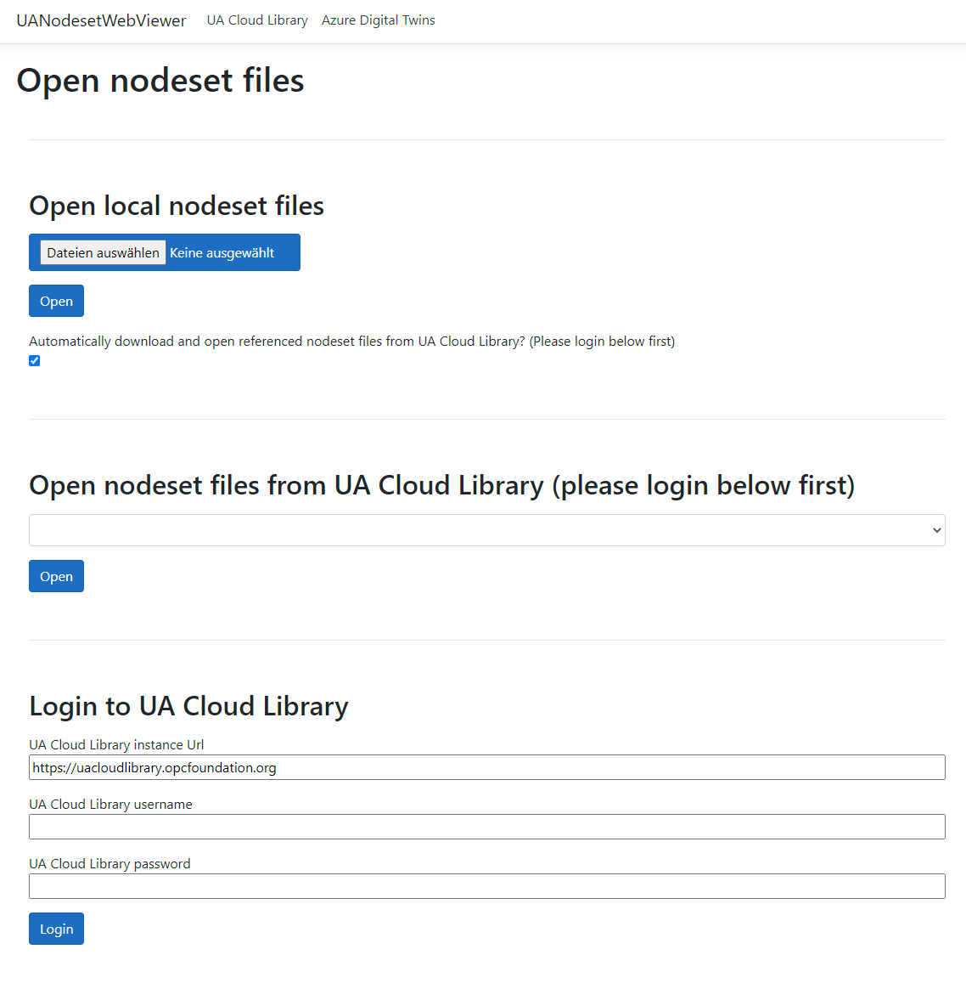
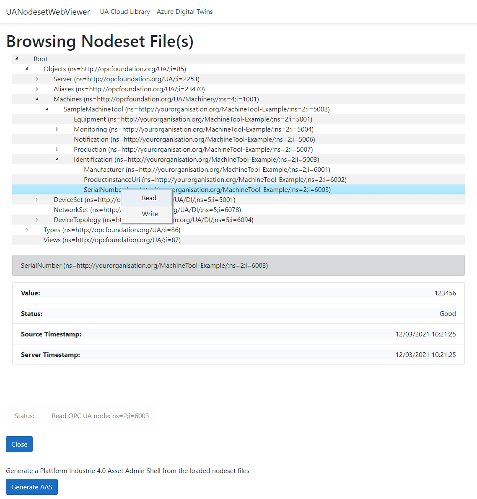
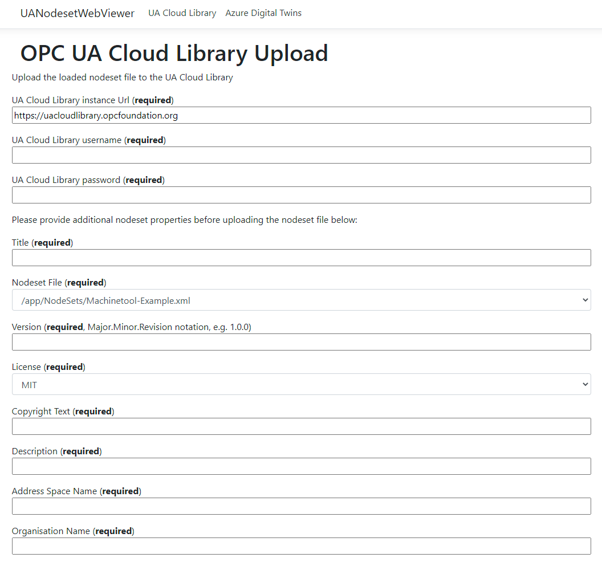

# UA-CloudNodesetViewer

**UA-CloudNodesetViewer** is a tool used in Industrial IoT scenarios to bridge the gap from OT to IT.

OPC UA is the standard interface for vendor-neutral Operational Technology (OT) interoperability in factories, plants and renewable energy farms with best-in-class data/information modeling functionality. The file format for these information models is called [_Nodesets_](https://reference.opcfoundation.org/v104/Core/docs/Part6/F.1/). As such, it defines the industrial digital twin, also known as the smart manufacturing profile. The OPC Foundation and CESMII have worked hard over the last year to make these information models/smart manufacturing profiles available online leveraging the new [UA Cloud Library](https://github.com/OPCFoundation/UA-CloudLibrary). The **UA-CloudNodesetViewer** can upload (and later download) these OPC UA information models to the UA Cloud Library.

The Plattform Industrie 4.0 in Europe has defined the industrial digital twin slightly broader, not only defining the OT digital twin, but the entire digital asset/product along its value chain, i.e. from design to manufacturing to operation to recycling. They call this industrial digital twin the Asset Administration Shell (AAS). The **UA-CloudNodesetViewer** can package OT digital twins into Asset Administration Shells, leveraging the AAS exchange format AASX (based on Open Office XML).

Microsoft has defined the IT digital twin using the [Digital Twin Definition Language (DTDL)](https://docs.microsoft.com/en-us/azure/digital-twins/concepts-models). It also runs a cloud service leveraging these DTDL-based digital twins for analytics called the Microsoft Azure Digital Twins (ADT) service. The **UA-CloudNodesetViewer** can map OT digital twins to DTDL definitions and then upload them to ADT instances.

Additional features of the **UA-CloudNodesetViewer** include the ability to run in a Docker container for easy deployment and maintenance and comes with a Web user interface. Several OPC UA _NodeSet_ files can be loaded at once and then browsed. The tool is very useful for looking at the standardized _NodeSet_ files defined in the OPC UA companion specifications by the German machine builders association VDMA and the German machine tool builders association VDW.

## Usage

Docker containers are automatically built. Simply run the app via:

`docker run -p 80:80 ghcr.io/digitaltwinconsortium/ua-cloudnodesetviewer:main`

And then point your browser to <http://localhost>.

If you don't have Docker yet, you can download it for free from [here](https://www.docker.com/products/docker-desktop).

### Loading Nodeset Files

Open your OPC UA _NodeSet_ file.

Please note: Referenced _NodeSet_ files need to be uploaded, too.  It will tell you which ones or you can set a checkbox to automatically download referenced _NodeSet_ files from the UA Cloud Library.

You can also open OPC UA node _NodeSet_ set files directly from the UA Cloud Library.

### Browsing Nodeset Files

You can browse and interact with the model.
Currently `READ` and `WRITE` of a node is possible.

### Uploading Nodeset Files to the UA Cloud Library

On the UA Cloud Library tab, fill in your username and password you used when registering with the UA Cloud Library as well as metadata describing your nodeset file.

## Build Status

